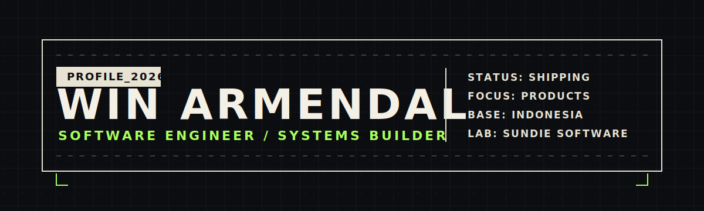

<p align="center">
  
</p>

<p align="center">
  <a href="https://winarmendal.com">
    
  </a>
  <a href="https://linkedin.com/in/ramadhani-win-armendal-624215222/">
    
  </a>
  <a href="https://github.com/winarmendal">
    
  </a>
</p>

<br />

<table width="100%">
  <tr>
    <td width="62%" valign="top">
      <h3>SYSTEM OBJECTIVE</h3>
      <p>
        I build product-grade software with a bias toward clean systems, practical architecture, and shipping.
      </p>
      <pre>2026: stop collecting stacks.
      start compounding systems.</pre>
      <p>
        Currently building <b>Sundie Software</b>, a small software lab focused on useful products, reliable tooling, and long-term technical leverage.
      </p>
      <h3>CURRENT MODE</h3>
      <ul>
        <li>Designing full-stack product flows</li>
        <li>Building backend systems with TypeScript</li>
        <li>Turning rough ideas into shippable software</li>
        <li>Keeping complexity on a short leash</li>
      </ul>
    </td>
    <td width="38%" valign="top">
      <h3>SIGNAL</h3>
      <pre>role      software engineer
focus     systems + products
stack     typescript first
lab       sundie software
base      indonesia</pre>
      <p>
        
      </p>
    </td>
  </tr>
</table>

<br />

### WORKING SET

<table width="100%">
  <tr>
    <td width="33%" valign="top">
      <p><b>Frontend</b></p>
      <p>
        
        
        
      </p>
    </td>
    <td width="33%" valign="top">
      <p><b>Backend</b></p>
      <p>
        
        
        
      </p>
    </td>
    <td width="33%" valign="top">
      <p><b>Infra</b></p>
      <p>
        
        
        
      </p>
    </td>
  </tr>
</table>

<br />

### OPERATING PRINCIPLES

```txt
useful > clever
simple > scalable too early
shipping > polishing forever
systems > isolated snippets
```

<br />

<p align="center">
  
</p>
